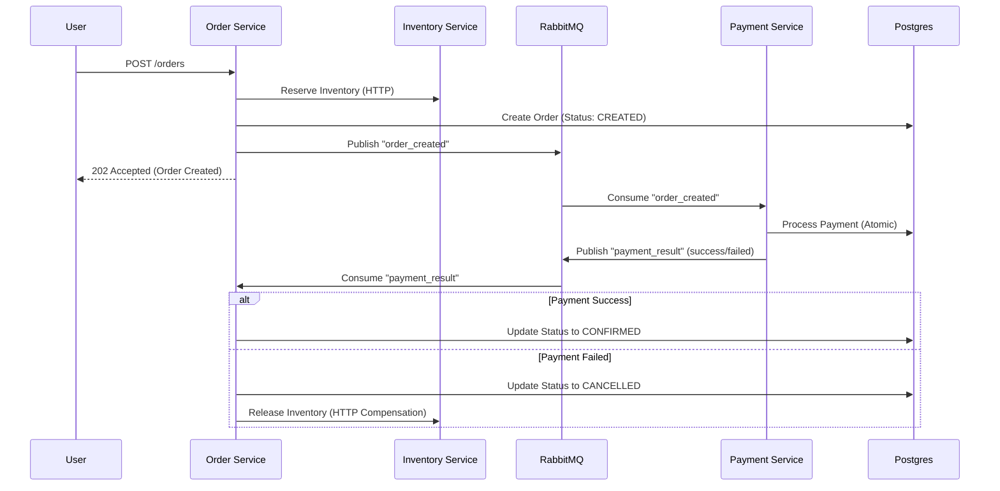

# FlashTix - Flash Sale Inventory System

FlashTix is a high-performance, microservices-based inventory and order management system designed for the extreme concurrency of flash sales. It utilizes an **Asynchronous Choreography-based Saga** pattern to ensure eventual consistency and system resilience.

## 🏗️ Architecture & Flow

The system uses **RabbitMQ** to decouple order creation from payment processing, allowing it to handle massive traffic bursts safely.

### Event-Driven Workflow (Saga Pattern)



## 🚀 Key Features

- **Asynchronous Scalability**: Order creation is non-blocking; the system "accepts" orders and processes payments in the background.
- **Microservice Resiliency**: 
    - **Persistent Retries**: Publishers and Consumers retry RabbitMQ connections up to 20 times to handle restarts.
    - **NO-ACK Persistence**: If the database is down, consumers will NOT acknowledge the message, ensuring it stays safely in the queue.
- **Strict Idempotency**: 
    - Prevents double-charging if messages are redelivered.
    - Prevents duplicate status updates if results are processed twice.
- **High-Concurrency Inventory**: Redis-backed reservations prevent overselling.

## 🛠️ Tech Stack

- **Backend**: Python 3.11, FastAPI
- **Messaging**: RabbitMQ 3 (Management Plugin enabled)
- **Database**: PostgreSQL 15 (SQLAlchemy ORM)
- **Caching**: Redis 7
- **Orchestration**: Docker & Docker Compose

## 🚦 Getting Started

1.  **Start all services**:
    ```bash
    docker-compose up --build
    ```
2.  **Access points**:
    - Order Service: `http://localhost:8002`
    - RabbitMQ UI: `http://localhost:15672` (guest/guest)
    - Inventory Service: `http://localhost:8001`
    - Payment Service: `http://localhost:8003`

3.  **Monitor Logs**:
    ```bash
    docker-compose logs -f order-service payment-service
    ```

## 🧪 Testing & Chaos Validation

### standard Flow
```powershell
Invoke-RestMethod -Uri http://localhost:8002/orders -Method Post -ContentType "application/json" -Body '{"event_id": 1, "quantity": 1}'
```

### Chaos Scenarios
The system is built to survive:
1.  **RabbitMQ Outage**: Services retry connection until restored; no messages lost.
2.  **Service Crash**: Messages remain in the queue until successfully processed and acknowledged.
3.  **Database Downtime**: Idempotency and NO-ACK logic ensure data integrity once the DB is back online.

*For detailed failure testing steps, see `chaos_testing_guide.md`.*
