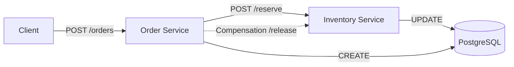

# FlashTix - High Concurrency Ticket Booking System

FlashTix is a backend-focused distributed system designed to handle high-concurrency ticket booking scenarios without overselling. It leverages a microservices architecture with a strong focus on distributed consistency and database integrity.

## System Design Overview
FlashTix is designed to handle high-concurrency ticket booking scenarios by centralizing inventory ownership, using synchronous reservation for strong consistency, and asynchronus event-driven workflows for payment and notifications.

### Core Architecture



## 🏗️ Technical Architecture

### Services
- **Inventory Service (Port 8001)**: 
  - Owns the source of truth for ticket stock.
  - Implements **SELECT FOR UPDATE** (Row-level locking) to prevent overselling.
- **Order Service (Port 8002)**: 
  - Manages the order lifecycle.
  - Coordinates between clients and the inventory service.

### Distributed Consistency Strategy
FlashTix uses a **Compensation-based (Saga-lite)** pattern to ensure eventual consistency:
1. **Synchronous Reserve**: Inventory is reserved and locked in the database.
2. **Order Creation**: If inventory reservation succeeds, an order record is created.
3. **Compensation**: If order creation fails (e.g., database error), the Order Service automatically sends a `release` request to the Inventory Service to restore the stock.

## 🛠️ Getting Started

### Prerequisites
- Docker & Docker Compose

### Fast Startup
Run the entire system in detached mode:
```bash
docker-compose up -d --build
```

### Checking Health
- **Inventory Service**: `curl http://localhost:8001/health`
- **Order Service**: `curl http://localhost:8002/health`

## 🧪 Testing with Postman

### 1. Create an Order
- **Method**: `POST`
- **URL**: `http://localhost:8002/orders`
- **Body (JSON)**:
  ```json
  {
      "event_id": 1,
      "quantity": 2
  }
  ```

### 2. Manual Inventory Reserve (Optional)
- **Method**: `POST`
- **URL**: `http://localhost:8001/inventory/reserve`
- **Body (JSON)**:
  ```json
  {
      "event_id": 1,
      "quantity": 1
  }
  ```

## 📊 Database Management

Reset tickets for testing (Event ID 1):
```bash
docker exec flash-tix-postgres-1 psql -U flashuser -d flashtix -c "UPDATE events SET available_tickets = 100, total_tickets = 100 WHERE id = 1;"
```
